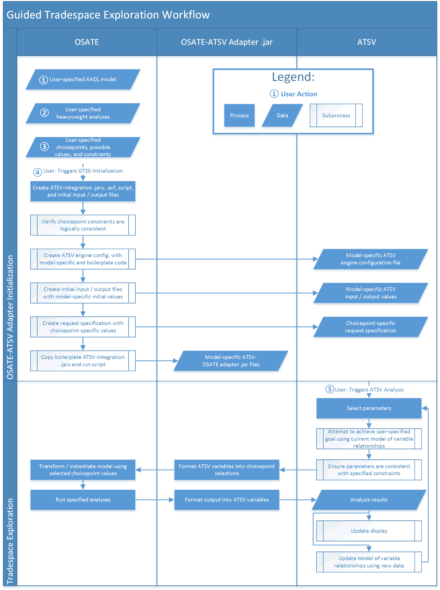

# Guided Tradespace Exploration Workflow

*If you're interested in a more practical / quickstart guide, see the [readme](../readme.md)*

Guided tradespace exploration using OSATE and ATSV takes place in two main phases: initialization and exploration.

## OSATE-ATSV Adapter Initialization

The first phase involves specifying an AADL model (labelled with a 1 in the diagram), one or more analyses (2), and a set of choicepoints that describe the possible component implementations and property values the AADL model can take (3). Then, you can trigger the GTSE-Initialization and OSATE will perform a number of tasks:

1. Ensure that your choicepoint constraints are feasible. That is, if you require that some property has the same value on components a and b and on b and c but that the property cannot have the same value for a and c, OSATE will detect the inconsistency and throw an exception. This is implemented by the ['Configurator Verifier' class](../org.osate.atsv.integration/src/main/java/org/osate/atsv/integration/ConfiguratorVerifier.java) in four steps:
    1. Converting the "configurators" (which specify variable equality or uniqueness) to equality logic (eg, x = y, y = z, x ≠ z).
    2. Converting the equality logic to propositional logic using Zantema and Groote's [Equality Substitution](http://dx.doi.org/10.1016/S1571-0661(04)80661-3).
    3. Converting the propositional logic to conjunctive normal form (CNF) using Sat4j's implementation of the [Tseitin Transformation](https://en.wikipedia.org/wiki/Tseytin_transformation).
    4. Checking the satisfiability of the resulting CNF expression using [Sat4j](http://www.sat4j.org/).
2. Create an ATSV engine configuration file. This file, created in the directory specified by the user in the plugin's preferences, is named ``ATSVConfig.ecf`` and is an XML-serialized version of the ['ExplorationEngineModel' class](../org.osate.atsv.integration/src/main/java/org/osate/atsv/integration/EngineConfigModel/ExplorationEngineModel.java). Users should never have to open / modify the engine configuration, but if you're curious you can see the javadoc / comments in the classes in that package for a deeper explanation of the specific elements of the config.
3. Create initial ATSV input / output files. These are very small, simple comma-delimited files named ``input.txt`` and ``output.txt`` that contain an entry for each input / output variable mapped to the variable's default value, which is derived from its type. These files (and those discussed in items 4 and 5 below) are generated by the ['GenerateInputFilesHandler' class](../org.osate.atsv.integration/src/main/java/org/osate/atsv/integration/preparser/GenerateInputFilesHandler.java), are also placed in the user-specified directory, and should never need user-interaction.
5. Generate ``request.properties``. This file encodes the user's choicepoint specifications in a format that is easily used by ``connector.jar``.
4. Copy ``connector.jar``, ``parser.jar``, and ``run.sh`` to the user-specified directory. These files do not depend on the user's model, though ``connector.jar`` may be updated between GTSE-plugin releases.
    * ``connector.jar`` opens a socket and uses it to connect the running version of OSATE to the running instance of ATSV. Its processes are shown in the middle column of the diagram.
    * ``parser.jar`` came with one of the ATSV examples, and it reads the input file and formats it for ATSV.
    * ``run.sh`` (or ``run.bat`` on windows systems) is what is executed by ATSV. It calls ``connector.jar`` with the user-specified port number.

## Tradespace Exploration

The second phase involves actually running ATSV (labelled with a 5 in the diagram). The best source for understanding ATSV are the papers published by the PSU developers, in particular see Stump et. al's [Visual Steering Commands for Trade Space Exploration: User-Guided Sampling with Example](http://dx.doi.org/10.1115/1.3243633). When the user selects the generated engine configuration and starts the analysis, the following steps occur repeatedly:

1. ATSV generates possible input values, either randomly or according to an optimization function, depending on if one has been specified. The input values are also consistent with regards to the constraints set previously.
2. The ``connector.jar`` creates a [Request](../org.osate.atsv.integration/src/main/java/org/osate/atsv/integration/network/Request.java) object based on the ATSV input values (both specific choices for choicepoints and analyses to run), serializes it, and sends it to OSATE over its open port.
3. OSATE decodes the request object and uses it to instantiate the specified model using the specified choices.
4. OSATE runs the specified analyses on the newly-created instance model.
5. OSATE creates a [Response](/org.osate.atsv.integration/src/main/java/org/osate/atsv/integration/network/Response.java) object with the resulting values (or, if present, the exception that was thrown).
6. The ``connector.jar`` writes the output to the ``output.txt`` file and terminates.
7. ATSV reads the output file, uses the new data to pick new input values and -- if it's the end of the run -- updates the display.

